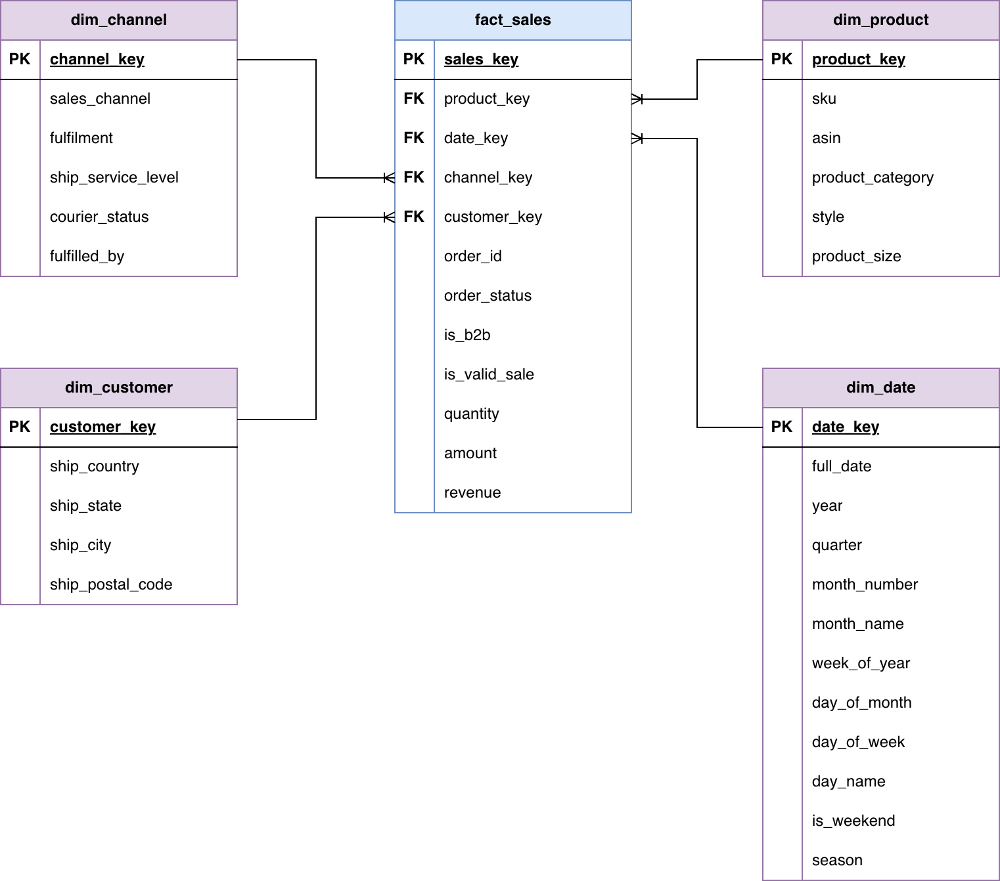

# Fashionable Data Warehouse

## Overview

This project implements a dimensional data warehouse for Fashionable sales data using dbt and DuckDB.

The solution follows a layered architecture:

```text
Raw Data
    │
    ▼
Staging
    │
    ▼
Intermediate
    │
    ▼
Dimensions + Facts
    │
    ▼
Analytics / Dashboarding
```

### Objectives

- Clean and standardize source data
- Create conformed dimensions and a sales fact table
- Implement data quality testing
- Support historical analysis through Slowly Changing Dimensions (SCD Type 2)
- Demonstrate scalable warehouse design patterns using dbt

---

## Technology Stack

| Component | Technology |
|------------|------------|
| Transformation | dbt |
| Database | DuckDB |
| Testing | dbt Tests, dbt-utils, dbt-expectations |
| Documentation | dbt Docs |
| Dashboarding | Streamlit |

---

## Project Structure

```text
models/
├── staging/
├── intermediate/
└── marts/
    ├── dimensions/
    └── facts/

snapshots/
tests/
macros/
```

### Layer Responsibilities

#### Staging

Source standardisation and type enforcement.

Responsibilities:

- Rename source columns
- Cast data types
- Handle null values
- Apply basic cleansing rules

#### Intermediate

Business logic layer.

Responsibilities:

- Deduplicate source records
- Generate surrogate keys
- Apply reusable business rules
- Prepare dimensional structures

#### Marts

Analytics-ready dimensional model.

Responsibilities:

- Build dimensions
- Build fact tables
- Apply SCD logic
- Expose curated reporting datasets

---

## Dimensional Model

The warehouse follows a dimensional modelling approach with a central sales fact table surrounded by conformed dimensions.



### Fact Table

#### fact_sales

The sales fact table contains transactional measures and foreign keys to supporting dimensions.

**Grain**

One row per:

```text
order_id + sku
```

**Measures**

- quantity
- amount
- revenue

**Foreign Keys**

- date_key
- customer_key
- product_key
- channel_key

### Dimensions

#### dim_customer

Contains customer attributes used for reporting and segmentation.

#### dim_product

Contains product attributes and tracks historical changes using SCD Type 2 methodology.

Historical attributes are managed using:

- valid_from
- valid_to
- is_current

Fact records are joined to the product version that was valid at the time of the sale, ensuring historical reporting accuracy.

#### dim_channel

Contains sales channel and fulfilment attributes.

#### dim_date

Calendar dimension supporting time-based reporting and analysis.

---

## Incremental Processing

The sales fact table is configured as an incremental model using a merge strategy.

Benefits include:

- Faster execution times
- Reduced resource consumption
- Support for updating existing records
- Foundation for handling late-arriving data

The current implementation demonstrates the incremental pattern and can be extended to include configurable lookback windows for production workloads.

---

## Data Quality Testing

The project includes tests across multiple layers of the warehouse.

### Source Integrity

- Not null validation
- Accepted values validation
- Source key uniqueness checks

### Referential Integrity

- Fact-to-dimension relationship testing
- Foreign key validation

### Business Rule Validation

- Revenue consistency checks
- Valid sales identification checks
- Fact grain validation

### Historical Data Validation

- Single current SCD record validation
- Effective date range validation
- Product history consistency checks

---

## Production Considerations and Future Enhancements

This assessment was implemented using DuckDB and dbt to demonstrate core warehouse design principles. The focus was on building a maintainable dimensional model with strong testing and documentation. In a production environment, several enhancements would be considered to improve scalability, maintainability, and operational resilience.

### Partitioning

Large fact tables would typically be partitioned by:

```text
order_date
```

to improve query performance and reduce the amount of data scanned during reporting workloads.

### Clustering

Fact tables could be clustered on commonly filtered or joined columns such as:

```text
customer_key
product_key
channel_key
```

to improve query efficiency.

### Late Arriving Data

Production pipelines should support late-arriving or corrected records through:

- Incremental merge strategies
- Configurable lookback windows
- Source update timestamps
- Reprocessing of recent partitions

### Change Data Capture (CDC)

Where available, source-system CDC streams would be leveraged to reduce processing costs and improve data freshness.

### Orchestration

Production scheduling and dependency management could be implemented using:

- Apache Airflow
- Dagster
- Azure Data Factory
- dbt Cloud

### CI/CD and Code Quality

Future improvements include:

- Automated testing in GitHub Actions
- SQLFluff linting and formatting enforcement
- Pull request validation pipelines
- Automated documentation generation

### Monitoring and Observability

Additional production controls could include:

- Data freshness monitoring
- Failed pipeline alerting
- Row count anomaly detection
- Data quality dashboards

### Cloud Data Warehouse Deployment

The dimensional model is designed to be portable to cloud platforms such as:

- Snowflake
- BigQuery
- Databricks

with minimal modification to the dbt transformation layer.